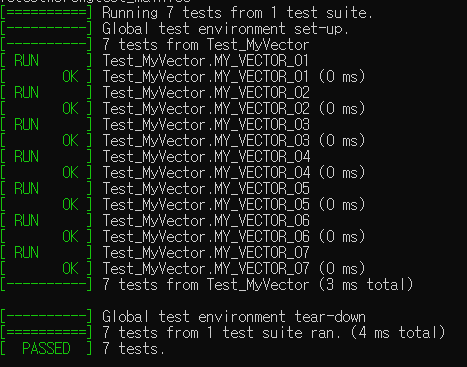

# Setup

1. Execute setup.bat
2. Execute build/*.sln


# Report

### ExpendCapacity(), DeAllocateCapacity()

```cpp
auto ExpendCapacity() -> void
{
    const size_t newCapacitySize = m_CapacitySize * 2;
    value_type* pNew = m_Allocator.allocate( newCapacitySize );

    if constexpr ( std::is_move_constructible<T>::value )
    {
        std::uninitialized_move( begin(), end(), pNew );
    }
    else
    {
        std::uninitialized_copy( begin(), end(), pNew );
    }

    DeAllocateCapacity();

    m_pData = pNew;
    m_CapacitySize = newCapacitySize;
}

auto DeAllocateCapacity() -> void
{
    std::destroy( begin(), end() );
    m_Allocator.deallocate( begin(), m_CapacitySize );
}
```

`ExpendCapacity()` 

1. 기존 메모리 크기의 2배 해당하는 메모리 할당.
2. 기존 메모리에 있는 데이터들을 신규 메모리(`pNew`) 로 복사(이동).
3. 기존 메모리 소멸 및 내부 포인터 및 메모리 크기 업데이트.

`DeAllocateCapacity()` 

1. 데이터 수 만큼 소멸자 호출
2. 할당 된 메모리 블록 해제.

추가로 주목 해야 할 부분은  `std::is_move_constructible<T>` 의 사용 부분이다.

```cpp
if constexpr ( std::is_move_constructible<T>::value )
{
    std::uninitialized_move( begin(), end(), pNew );
}
else
{
    std::uninitialized_copy( begin(), end(), pNew );
}
```

복사 관련해서는 항상  퍼포먼스를 핑계로 `memset` 을 줄 곧 생각 해 왔는데, **값 세팅 시 생성자를 호출 하지 않기에 타입 안정성이 떨어진다**는 사실을 알게되었다.

이동 가능 타입 여부를 컴파일 타임에 평가하여 효율적인 복사가 발생 할 수 있게 처리하였다.


### emplace_back()

```c++
template<class... ArgTypes>
auto emplace_back( ArgTypes&&... args )
{
    if ( ( m_Size + 1 ) > m_CapacitySize )
    {
        ExpendCapacity();
    }

    ::new( end() )T( std::forward<ArgTypes>( args )... );
    m_Size++;
}
```

[std::vector::emplace_back - cppreference.com](https://en.cppreference.com/w/cpp/container/vector/emplace_back)

> Appends a new element to the end of the container. The element is constructed through [std::allocator_traits::construct](https://en.cppreference.com/w/cpp/memory/allocator_traits/construct), which typically uses placement-new to construct the element in-place at the location provided by the container. 


[std::allocator_traits::construct - cppreference.com](https://en.cppreference.com/w/cpp/memory/allocator_traits/construct)

> ```cpp
> ::new (static_cast<void*>(p)) T(std::forward<Args>(args)...) (until C++20)
> ```

위 내용에 따르면, placement new 를 통해 데이터가 추가 됨을 알 수 있다.

그래서 조사 내용에 따라 전달 받은 인자를 Perfect forwarding 하고, 데이터가 추가되어야 할 위치(`end()`) 에 `args` 를 통해 객체를 생성하도록 구현하였다.

placement new 관련해서 주의 사항도 있었는데, **바로 placement new 를 통해 생성한 객체를 delete 를 이용해 메모리 할당을 해제하면 안된다는 점**이였다.(**소멸자를 직접 호출하여 처리해야 함, 관련 예제 아래 참조**)

```cpp
#include <new> 
int main() {
    char buffer[sizeof(int)];
    int* ptr = new (buffer) int(5);
    // 소멸자 직접 호출
    ptr->~int();
    // 메모리 해제는 필요하지 않음 (buffer는 스택에 할당되었기 때문에 자동으로 해제됨)
    return 0;
}
```

이 부분은 조금만 생각 해 보면 당연하다.

placement new 는 new 와 달리 메모리 할당의 역할은 없다, 즉 객체에 대한 연관은 있지만 메모리 할당/소멸에 대한 연관은 없다.('난 placement 가 메모리 관련한 권한은 없다 라는 형태로 이해했다.')

이러한 상황에서 delete 를 호출하게 되면 정의되지 않은 동작이 발생하기에 주의하자.


### push_back()

원인 찾는데 가장 시간을 많이 들인 부분이다.

```cpp
// push_back(const&)
const SimpleStruct sample{ 1, 2, "Example" };
ptr[ 0 ] = sample;

// push_back(&&)
ptr[ 0 ] = std::forward<SimpleStruct>( sample );
```

Unit test 돌리기 전 까지는, 위와 같이 push_back 을 구현했었고, 당연 될 줄 알았다.

하지만 test 돌리자 말자, 위 코드에서 실행 시 invalid 메모리 참조로 error 가 발생했다.

원인은 allocator 로 할당한 메모리를 사용하는 부분에 있었다.('나도 아직 멀었네...').

allocator 를 이용해 할당한 메모리 공간은 말 그대로 공간 만 존재하고 미 초기화 상태, 즉 유효 데이터(객체)가 존재하는 상태가 아니다. ('미 초기화 된 변수를 사용하는 느낌으로 보면 되며, new 호출과의 차이점이기도 하다')

유효 객체가 존재하지 않는 공간에 복사 또는 이동 배정 연산을 시도 했으니 에러가 날 만도 하다.

솔루션은 메모리에 객체가 존재하는 상태가 아니니, 지정한 메모리 위치에 객체가 복사 또는 이동 생성자를 통해 생성되게 만들면 된다, 즉 placement new가 호출되게 만들면 된다.

[std::vector](https://github.com/microsoft/STL/blob/main/stl/inc/vector)도 잘 살펴 보면, push_back 연산이 emplace_back 을 통해(생성자 호출을 통해) 데이터를 추가하고 있음을 알 수 있다.(emplace_back 자체가 생성자 호출이고, 생성자 호출 때 객체를 던지게 되면 l-value, r-value 에 따라 복사 또는 이동 생성자가 호출 됨. )

이를 토대로 구현한 코드는 아래와 같다.

```cpp
auto push_back( const T& data ) -> void
{
    if ( ( m_Size + 1 ) > m_CapacitySize )
    {
        ExpendCapacity();
    }

    emplace_back( data );
}

auto push_back( T&& data ) -> void
{
    if ( ( m_Size + 1 ) > m_CapacitySize )
    {
        ExpendCapacity();
    }

    emplace_back( std::forward<T>( data ) );
}
```


### Unit Test List & Result

1. **MY_VECTOR_01**: 지정된 개수의 초기값을 가진 `int` 객체들이 정상적으로 생성되는지 확인.
2. **MY_VECTOR_02**: 지정된 개수의 `SimpleStruct` 객체들이 정상적으로 생성되는지 검증.
3. **MY_VECTOR_03**: 매개변수 없이 `MyVector<int>` 객체 생성 시 크기가 0인지 테스트.
4. **MY_VECTOR_04**: `SimpleStruct` 타입을 사용하는 `MyVector`의 복사 생성자가 정상 작동하는지 확인.
5. **MY_VECTOR_05**: `SimpleStruct` 타입 `MyVector`의 이동 생성자가 정상적으로 작동하는지 검사.
6. **MY_VECTOR_06**: l-value `push_back` 메서드가 `SimpleStruct` 타입 `MyVector`에 대해 정상적으로 동작하는지 확인.
7. **MY_VECTOR_07**: r-value `push_back` 메서드가 `SimpleStruct` 타입 `MyVector`에서 예상대로 작동하는지 테스트.

# Reference

[STL/stl/inc/vector at main · microsoft/STL (github.com)](https://github.com/microsoft/STL/blob/main/stl/inc/vector)

[std::vector::emplace_back - cppreference.com](https://en.cppreference.com/w/cpp/container/vector/emplace_back)

[std::allocator_traits::construct - cppreference.com](https://en.cppreference.com/w/cpp/memory/allocator_traits/construct)


 


