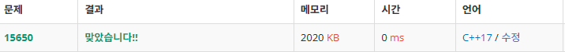

# N과 M (2)


### 문제 출처

[15650번: N과 M (2) (acmicpc.net)](https://www.acmicpc.net/problem/15650)


### 풀이

[N과 M (1) 문제](https://github.com/jeonghobak/GoBackToWhiteBelt/blob/main/PS/%EB%B0%B1%EC%A4%80_15649/N%EA%B3%BC%20M%20(1).md) 의 확장 버전.

- 재귀 함수는 각 Depth 마다 이전에 선택했던 숫자(`prevNumber`) 를 인자로 전달 받는다.
- 재귀 함수 내 숫자 선택 시, 범위를 `prevNumber+1` ~ `N` 으로 한정한다.

```cpp
#include <iostream>
#include <array>

constexpr int MAX_NUMBER = 8;

int g_N;
int g_M;

std::array<int, MAX_NUMBER + 1> g_Choices;
std::array<bool, MAX_NUMBER + 1> g_IsChoiced;

void DFS( const int nextIndex, const int prevNumber )
{
	if ( nextIndex > g_M )
	{
		for ( int i = 1; i <= g_M; ++i )
		{
			std::cout << g_Choices[ i ] << ' ';
		}
		std::cout << '\n';
		return;
	}

	for ( int num = ( prevNumber + 1 ); num <= g_N; ++num )
	{
		if ( ! g_IsChoiced[ num ] )
		{
			g_IsChoiced[ num ] = true;
			g_Choices[ nextIndex ] = num;
			DFS( nextIndex + 1, num );
			g_IsChoiced[ num ] = false;
		}
	}
}

int main()
{
	std::cin.tie( nullptr );
	std::cout.tie( nullptr );
	std::ios::sync_with_stdio( false );

	std::cin >> g_N >> g_M;
	DFS( 1, 0 );
}
```


### 결과



