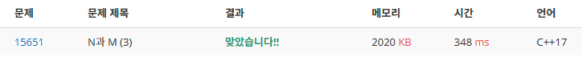

# N과 M (3)

### 문제 출처
https://www.acmicpc.net/problem/15651

### 문제 풀이
DFS 의 깊이 `depth`를 수열`numbers[]`의 Index로 정의.  
DFS 호출 마다 `1 ~ N`범위를 돌면서 `numbers[depth]`에 해당 하는 수를 선택하면 되는 문제.

### 코드
```cpp
#include <iostream>

#define COMMON_OPTION \
std::cin.tie( nullptr );\
std::cout.tie( nullptr );\
std::ios::sync_with_stdio( false );\

int n;
int m;
int numbers[ 8 ];

void DFS( const int nextIndex )
{
	if ( nextIndex > m )
	{
		for ( int i = 1; i <= m; ++i )
		{
			std::cout<< numbers[ i ] << ' ';
		}
		std::cout << '\n';
		return;
	}

	for ( int i = 1; i <= n; ++i )
	{
		numbers[ nextIndex ] = i;
		DFS( nextIndex + 1 );
	}
}

int main()
{
	COMMON_OPTION;
	std::cin >> n >> m;
	DFS( 1 );
}
```

### 결과
